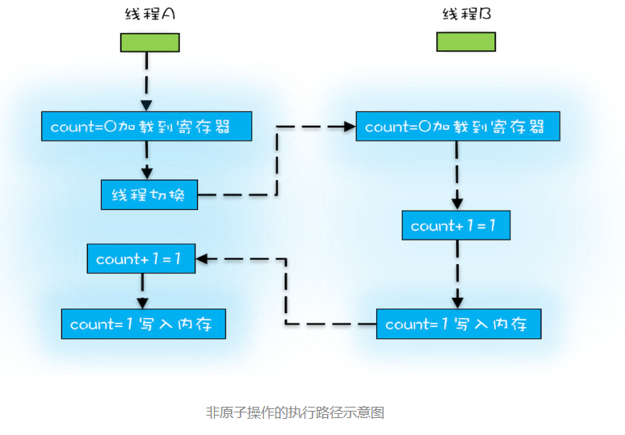
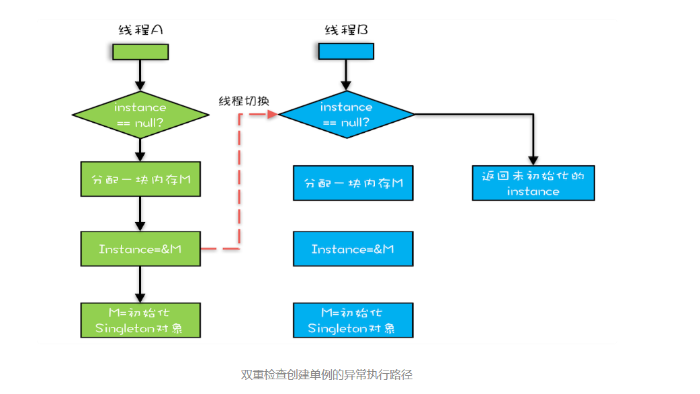

# 并发编程

## 可见性 原子性 有序性
为了合理利用 CPU 的高性能，平衡这三者的速度差异，计算机体系结构、操作系统、编译程序都做出了贡献，主要体现为：
* CPU 增加了缓存，以均衡与内存的速度差异；
* 操作系统增加了进程、线程，以分时复用 CPU，进而均衡 CPU 与 I/O 设备的速度差异；
* 编译程序优化指令执行次序，使得缓存能够得到更加合理地利用。现在我们几乎所有的程序都默默地享受着这些成果，但是天下没有免费的午餐，并发程序很多诡异问题的根源也在这里。

* cpu增加缓存导致的可见性问题；
* 操作系统线程切换带来的原子性问题；
* 编译程序优化指令执行次序带来的有序性问题；

现在我们几乎所有的程序都默默地享受着这些成果，但是天下没有免费的午餐，并发程序很多诡异问题的根源也在这里。

count += 1，至少需要三条 CPU 指令。
* 指令 1：首先，需要把变量 count 从内存加载到 CPU 的寄存器；
* 指令 2：之后，在寄存器中执行 +1 操作；
* 指令 3：最后，将结果写入内存（缓存机制导致可能写入的是 CPU 缓存而不是内存）。

我们潜意识里面觉得 count+=1 这个操作是一个不可分割的整体，就像一个原子一样，线程的切换可以发生在 count+=1 之前，
也可以发生在 count+=1 之后，但就是不会发生在中间。我们把一个或者多个操作在 CPU 执行的过程中不被中断的特性称为原子性。
CPU 能保证的原子操作是 CPU 指令级别的，而不是高级语言的操作符，这是违背我们直觉的地方。因此，很多时候我们需要在高级语言层面保证操作的原子性。

## 总结
缓存导致的可见性问题，线程切换带来的原子性问题，编译优化带来的有序性问题
其实缓存、线程、编译优化的目的和我们写并发程序的目的是相同的，都是提高程序性能。但是技术在解决一个问题的同时，必然会带来另外一个问题，所以在采用一项技术的同时，一定要清楚它带来的问题是什么，以及如何规避。