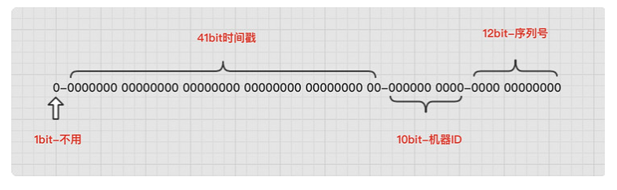

# 雪花算法
雪花（snowflake），美丽、独特又变幻莫测。在大自然中几乎找不到两片完全一样的雪花。雪花的这些特性正好在雪花算法上有所展示。

SnowFlake算法是Twitter开源的分布式ID生成算法。核心思想就是：使用一个64 bit的 long 型的数字作为全局唯一ID。算法中还引入了时间戳，基本上保证了自增特性。

最初的版本的雪花算法是基于scala写的，当然，不同的编程语言都可以根据其算法逻辑进行实现。

## 算法解析
第一个部分：1个bit，无意义，固定为0。二进制中最高位是符号位，1表示负数，0表示正数。ID都是正整数，所以固定为0。
第二个部分：41个bit，表示时间戳，精确到毫秒，可以使用69年。时间戳带有自增属性。
第三个部分：10个bit，表示10位的机器标识，最多支持1024个节点。此部分也可拆分成5位datacenterId和5位workerId，datacenterId表示机房ID，workerId表示机器ID。
第四部分：12个bit，表示序列化，即一些列的自增ID，可以支持同一节点同一毫秒生成最多4095个ID序号。

## 41位时间戳最长只能有69年
下面来用程序推算一下，41位时间戳为什么只能支持69年。

41的二进制，最大值也就41位都是1，也就是说41位可以表示2^{41}-1个毫秒的值，转化成单位年则是(2^{41}-1) / (1000 60 60 24 365) = 69年。

## 前后端数值类型

在使用雪花算法时，由于生成的ID是64位，在传递给前端时，需要考虑以字符串的类型进行传递，否则可能会导致前端类型溢出，再回传到服务器时已经变成另外一个值。

这是因为Number类型的ID在JS中最大只支持53位，直接将雪花算法的生成的ID传递给JS，会导致溢出。

## 缺点